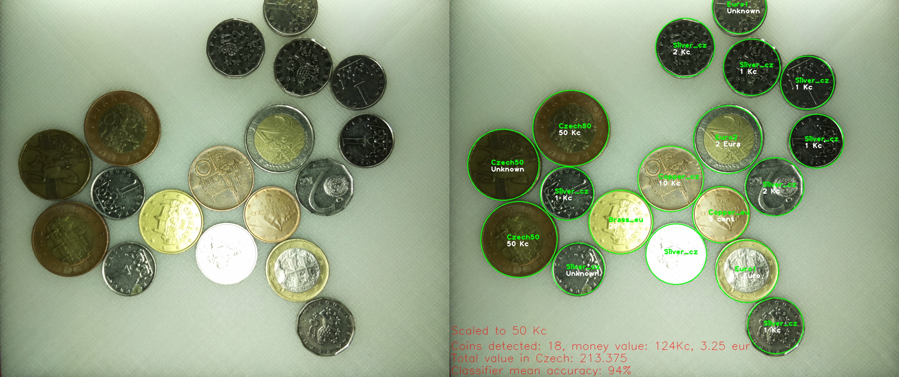
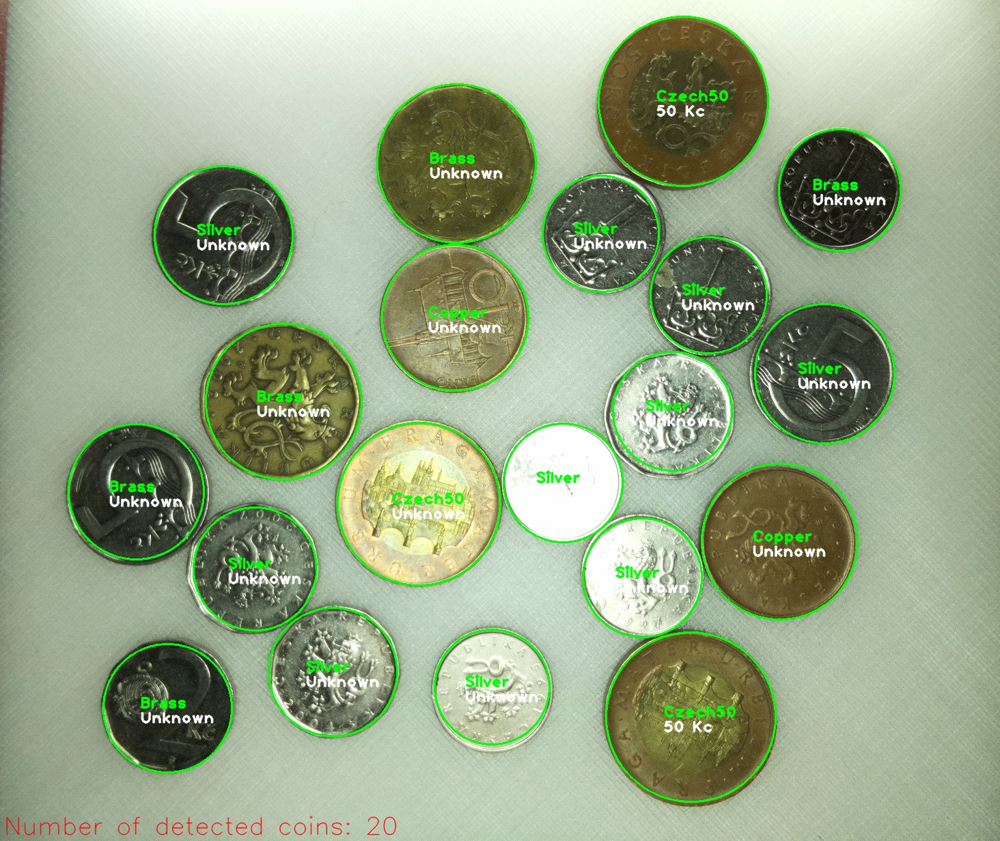
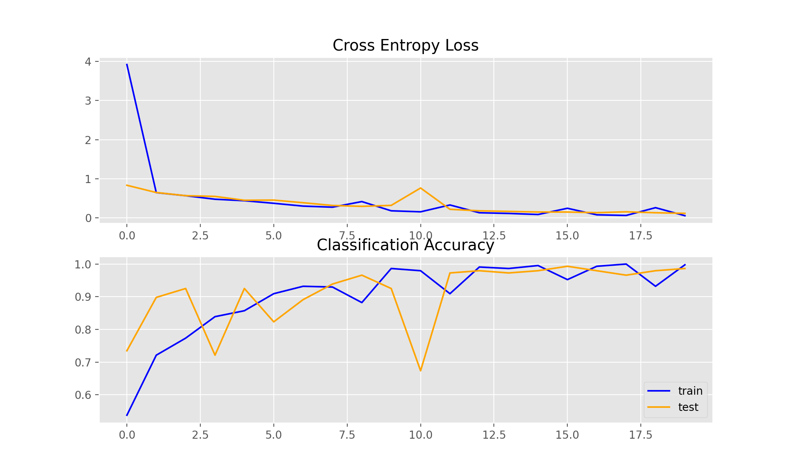
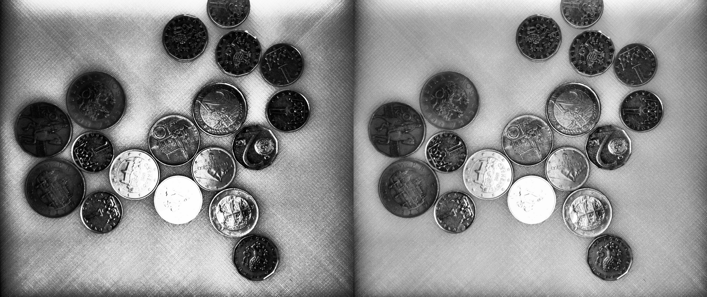
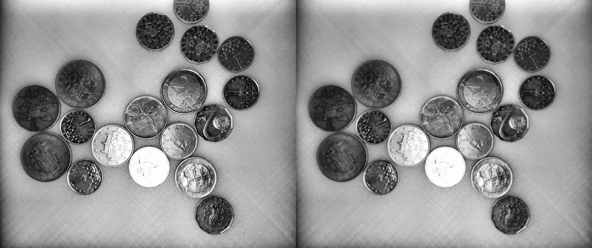
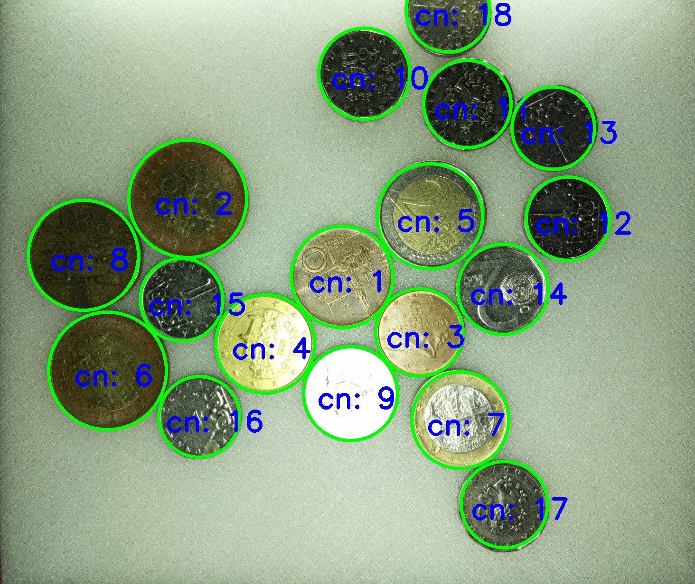
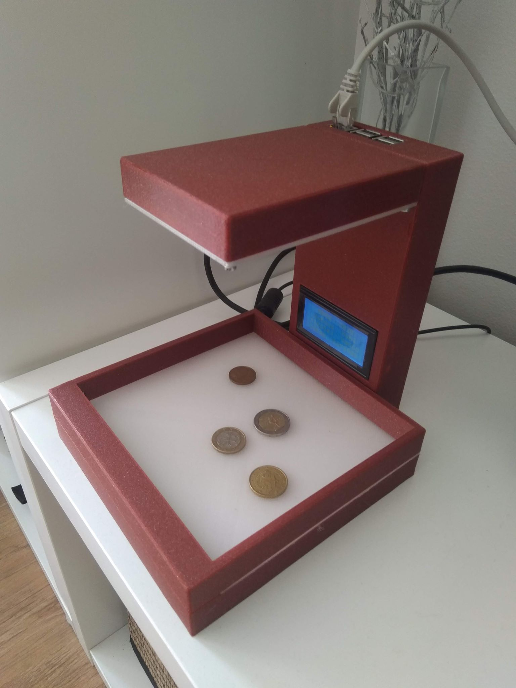

# COIN DETECTION & RECOGNITION

This is a project for coin detection with OpenCV and recognition of their material with neural networks and convolution neural networks.

Project consist of 3 parts:
- hardware 
- software for controlling hardware and visualizing results
- detection of coins and recognition of their material

### FINAL RESULT with Neural Network:

Detector found all coins and then neural network recognize almost all of them really good. Recognition works on learning 
avery material based on histogram of coins with specific material.

Classifier accuracy: 94%

### FINAL RESULT with Convolution Neural Network:

Detector also found all coins, but recognition of material wasn't that good, as in Neural Network.
On the other hand, CNN can recognize all 50kc coins better than normal NeuralNet.

Crossentropy loss on 20 epoch:

## Detection of coins

Detection of coins works on HoughCircle function from OpenCV.
Detection algorithm works like this:

1 - Take RGB picture and transfer it into Gray with cv2.COLOR_BRG2GRAY

2 - Use CLAHE function for adaptive histogram equalization (difference is on the picture)

3 - Use GaussianBlur with 7x7 kernel

4 - Use HoughCircle function. As input image is blur image and other parameters has to be set based on input picture (such
as min and max size of circle etc...)

Every found coin is then used as an input into Neural Network for prediction of material.

# Hardware

This is final result how hardware looks like (This was made by my friend Matus, I was responsible just for algorithm for detection and recognition)

